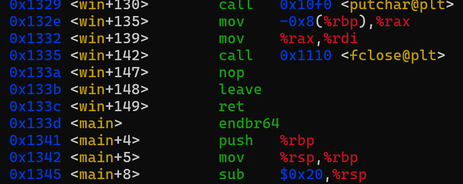

# PIE TIME

When connecting to this CTF, it immediately asks for an address relative to `main()`. This is confusing, but downloading the files of the CTF reveals this is a C program with an executable.

If we look at the C code, we find that before `main` is a `win` function, that will open the `flag.txt` file.

Moving on to the executable, if we run the `gdb` debugger on it, we can see that `win` is $150$ addresses before `main`:

Note that this was run with command `gdb vuln` and inside the gdb, displayed with `layout asm` and scrolling up. The offset of `win` in the image above identifies it as being $150$ address from `main`.

When we go back into the CTF, we just have to subtract the hex address value by $150_{10} = 96_{16}$. This address is different for every iteration, but the difference between addresses will be the same. Upon completion, the flag should be provided:

Solution: **picoCTF{b4s1c_p051t10n_1nd3p3nd3nc3_3d38fb4b}**